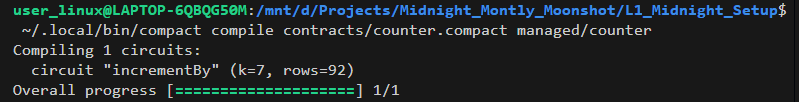
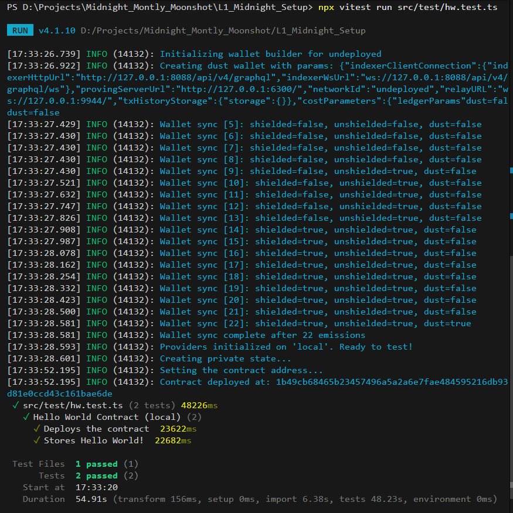

# Midnight Counter DApp — Level 2

> A privacy-preserving Counter smart contract DApp built on the Midnight Network using the Compact language and React + Vite frontend.

## 🚀 Live DApp Deployment

- **Live Frontend URL:** [https://midnightmoonshot.vercel.app](https://midnightmoonshot.vercel.app)

## Contract Address

| Network  | Address                                                          |
|----------|------------------------------------------------------------------|
| Preview  | `9a6287e343929ac29e6aa910eca52a0db7ecd9dc794ad6658f2619df57ea1417` |
| Preprod  | `9a6287e343929ac29e6aa910eca52a0db7ecd9dc794ad6658f2619df57ea1417` |

## What This Does

This smart contract DApp implements a privacy-preserving counter. It allows users to connect their Lace Wallet and execute zero-knowledge circuit calls on the Midnight ledger while keeping the exact increment amount (private witness input) completely private off-chain until explicitly disclosed via zero-knowledge proofs.

## Privacy Model

- **What is PUBLIC (on-chain, visible to anyone):**
  - `count`: The `Uint<32>` public ledger state variable representing the current counter total.
- **What is PRIVATE (private witness, never on-chain):**
  - `secretIncrement`: The `Uint<32>` private circuit witness passed from the client machine.
- **What the user PROVES without revealing:**
  - **Proved without revealing your input**: The user proves they possess a valid `Uint<32>` increment value and that the new state accurately reflects the previous counter state incremented by `disclose(secretIncrement)` without exposing sensitive private context on-chain.

## Tech Stack & Architecture

- **Midnight Network**: Privacy-focused zero-knowledge blockchain platform
- **Compact Language**: Smart contract domain-specific language (v0.23)
- **Frontend Framework**: React 19 + Vite (TypeScript)
- **Deployment**: Vercel (`vercel.json`)
- **Wallet & SDK**: Lace Wallet Connector API (`@midnight-ntwrk/dapp-connector-api`)
- **Node.js**: v22.21.1

## Prerequisites

- **Node.js** v22 or higher
- **Yarn** v1.22+ or **npm** v11+
- **Lace Wallet** Chrome Extension (for live testnet wallet interaction)

## Local Development & Setup

1. **Clone the repository:**
   ```bash
   git clone <your-repo-url>
   cd L1_Midnight_Setup
   ```

2. **Install dependencies:**
   ```bash
   yarn install
   ```

3. **Start local Vite development server:**
   ```bash
   npm run dev
   ```

4. **Build production web app:**
   ```bash
   npm run build
   ```

## Run Tests

Run the Vitest test suite covering circuit logic, state transitions, and zero-knowledge privacy:

```bash
npx vitest run tests/counter.test.ts
```

## Screenshots

### 1. Compact Compiler Output


### 2. Contract Deployment & Verification Output
