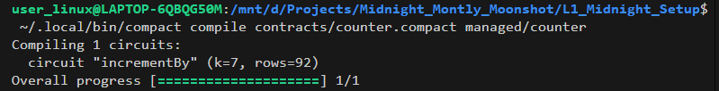
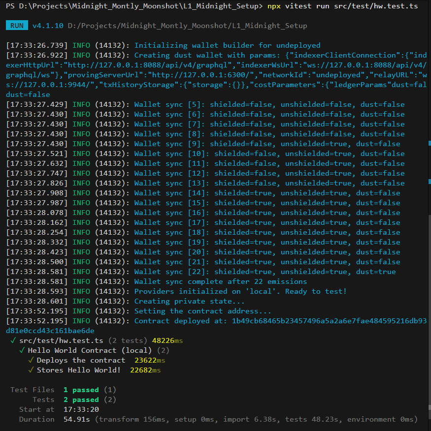

# Midnight Counter DApp

> A privacy-preserving Counter smart contract DApp built on the Midnight Network using the Compact language and React + Vite frontend.

## Live Demo

[https://midnightmoonshot.vercel.app](https://midnightmoonshot.vercel.app)

## Contract Address

| Network  | Address                                                          | Explorer Link |
|----------|------------------------------------------------------------------|---------------|
| Preview  | `cb3467ba7f41c0fa780ef2f1a4fec47366f9ac7eb225c2266d6b843964aca3b3` | [View on Midnight Preview Explorer](https://explorer.preview.midnight.network/contracts/stream/cb3467ba7f41c0fa780ef2f1a4fec47366f9ac7eb225c2266d6b843964aca3b3) |

## What This Does

This DApp implements a privacy-preserving counter on the Midnight Network (Preview Testnet). It allows users to connect their Lace Wallet or 1 AM Wallet and execute zero-knowledge circuit calls (`incrementBy`) to update a global counter on the Midnight ledger while keeping the increment amount (private witness) completely private off-chain until explicitly disclosed via zero-knowledge proofs.

## Initial Product Idea

### Anonymous Proof-of-Action Reputation Ledger
This application serves as the foundation for a privacy-preserving reputation and engagement protocol on Midnight Network. Users can anonymously prove off-chain actions or verifiable achievements—such as voting participation, tier progression, or private credentials—to incrementally update their on-chain score via zero-knowledge proofs (`incrementBy`) without disclosing their identity, transaction history, or sensitive private payload inputs on the public ledger.

## Privacy Model

- **What is PUBLIC:**
  - `count`: The `Uint<32>` public ledger state variable representing the current counter total on-chain.
- **What is PRIVATE:**
  - `secretIncrement`: The `Uint<32>` private circuit witness passed locally from the client machine.
- **What the user PROVES without revealing:**
  - The user proves they possess a valid `Uint<32>` increment value and that the updated state reflects `count + disclose(secretIncrement)` without exposing sensitive private context on-chain.

## Privacy Claim

An on-chain observer or block explorer sees the updated public `count` value on the Midnight ledger, but CANNOT see the exact private witness input value (`secretIncrement`) used during the zero-knowledge circuit execution.

## Tech Stack

- **Midnight Network**: Privacy-focused zero-knowledge blockchain platform (Preview Testnet)
- **Compact Language**: Smart contract domain-specific language (v0.23)
- **Midnight.js SDK**: DApp Connector API (`@midnight-ntwrk/dapp-connector-api`)
- **React / Vite**: Modern TypeScript frontend UI framework
- **Lace / 1 AM Wallet**: Browser wallet extensions for Midnight network transactions

## Prerequisites

- **Lace Wallet** or **1 AM Wallet** browser extension installed (set to Preview Testnet)
- **Node.js** v22 or higher
- **Docker Engine** (for running local proof server and devnet stack)

## Run Locally

1. **Clone the repository:**
   ```bash
   git clone https://github.com/Soujanya-Mctrl/Midnight_Moonshot.git
   cd Midnight_Moonshot
   ```

2. **Install dependencies:**
   ```bash
   yarn install
   ```

3. **Start local development server:**
   ```bash
   npm run dev
   ```

4. **Build production web app:**
   ```bash
   npm run build
   ```

## Create the Compact Smart Contract

```compact
pragma language_version 0.23;

export ledger count: Uint<32>;

export circuit incrementBy(secretIncrement: Uint<32>): [] {
  count = (count + disclose(secretIncrement)) as Uint<32>;
}
```

- `pragma language_version` specifies which version of Compact your contract uses.
- `ledger count` creates a state variable named `count` that stores an integer value in the on-chain state. On-chain state is public and persistent on the blockchain.
- `circuit incrementBy` is a Compact circuit (function) that defines the logic to modify on-chain state.
- `secretIncrement: Uint<32>` is the input parameter. *Circuit parameters are always private by default.* The `disclose()` function marks the private value as safe to store publicly. Without it, trying to assign `secretIncrement` directly to the ledger returns a compiler error.

## Compile the Contract

Compiling transforms your Compact code into zero-knowledge circuits, generates cryptographic keys, and creates TypeScript APIs and a JavaScript implementation for the contract to be used by DApps.

Run the compiler:

```bash
compact compile contracts/counter.compact managed/counter
```

You should see output similar to:

```
Compiling 1 circuits:
  circuit "incrementBy" (k=6, rows=26)
```

The compilation process will:
1. Parse and validate your Compact code.
2. Generate zero-knowledge circuits from your logic.
3. Create proving and verifying keys for the circuits.
4. Generate the TypeScript API and JavaScript implementation for the contract.

When compilation completes, you'll see the generated directory structure:

```
contracts/
├── counter.compact              # Counter Compact smart contract
├── hello-world.compact          # Hello World Compact smart contract
├── counter-index.ts             # Counter contract barrel file
├── index.ts                     # Hello World contract barrel file
└── managed/                     # Compiled ZK circuit artifacts
     └── counter/
          ├── compiler/          # Compiler metadata JSON
          ├── contract/          # JavaScript runtime & TypeScript definitions
          ├── keys/              # Prover (.prover) and verifier (.verifier) keys
          └── zkir/              # Zero-Knowledge Intermediate Representation (.zkir)
```

Here's what each directory contains:
- **contract/**: The compiled contract artifacts, which include the JavaScript implementation and type definitions.
- **keys/**: Cryptographic proving and verifying keys that enable zero-knowledge proofs.
- **zkir/**: Zero-Knowledge Intermediate Representation—the bridge between Compact and the ZK backend.
- **compiler/**: Compiler-generated JSON output that other tools can use to understand the contract structure.

## Deploy Contract to Local Devnet

Be sure the Docker engine is running and start the local environment stack:

```bash
yarn env:up
```

Run the local test suite:

```bash
yarn test:local
```

Stop the Docker containers when done:

```bash
yarn env:down
```

## Deploy Contract to Live Testnet (Preview / Preprod)

To run contract scripts on Preview or Preprod:
1. Generate a wallet on the target network and fund it via the network's faucet page — [Preview](https://midnight-tmnight-preview.nethermind.dev/) or [Preprod](https://midnight-tmnight-preprod.nethermind.dev/).
2. Create `.env.<network>` (e.g. `.env.preview`) based on `.env.preview.example`.
3. Start the proof server: `yarn proof:up`
4. Run deployment script: `yarn deploy:preview` or run tests: `yarn test:preview`.

## Screenshots

### Smart Contract Compilation


### Network Deployment


## Demo Video

[Demo Video](https://drive.google.com/file/d/1h5w8XuM10CAimDA85STW0bI9qKYl67Rv/view?usp=sharing)
